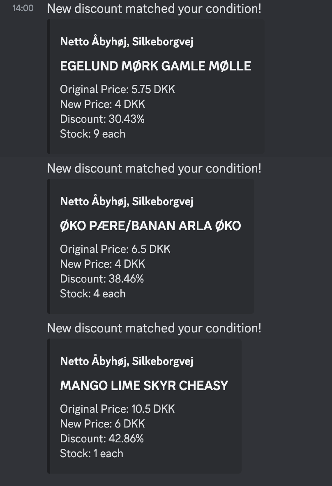

# Discount Alerter

Discount Alerter is a plugin-based alerter that notifies you based on user-defined conditions.

# Getting Started

## Requirements

## Server

## Client

# Concepts

## Providers

## Alerts

Alerts consists of 2 parts - conditions and notification channels.

The conditions specifies when the alert should trigger. Conditions are defined using a simple expression syntax that takes a property, an operation and a value. E.g. `offer.percentDiscount > 10` specifies that the alert should trigger when the percent discount for any product is larger than 10%

Example of how alerts are stored:

```json
{
    "conditionsEvaluationContext": "EVERY",
    "conditions": ["offer.currency == \"DKK\"", "offer.percentDiscount"],
    "notificationChannelIds": ["@michaelbui99-discount-alerter/discord-channel"]
}
```

An alert can have multiple conditions and you can specify under which context the alert should trigger using `conditionsEvaluationContext`.
</br>`EVERY` is equivalent to a logical AND, thus the alert will only trigger if <strong>all</strong> of the conditions are fulfilled.
</br> `SOME` is equivalent to a logical OR, thus the alert will trigger when any of the specified conditions are fulfilled.

## Notification Channels

Notification Channels are one of the supported plugin types. They handle the actual sending of notifications to the user when an alert is triggered. There can exists different implementations such as sending the notification through Discord, Slack, email etc.</br>

### Discord Notification Channel

Currently Discount Alerter is shipped with a Discord plugin out-of-the-box.
You can enable notification channel by adding `@michaelbui99-discount-alerter/discord-notification-channel` the `channels.configurations` section in the `app-config.yaml` file:

```yaml
channels:
    configurations:
        - channel: '@michaelbui99-discount-alerter/discord-notification-channel'
          config:
              WEBHOOK: YOUR_DISCORD_WEBHOOK
```



## Storage
